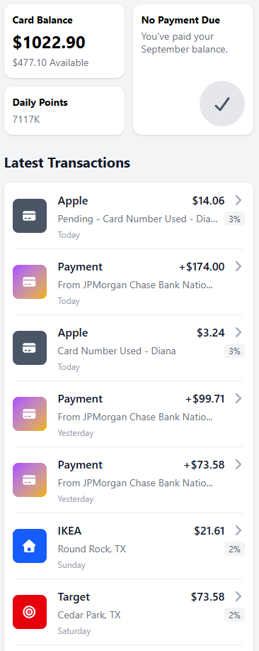
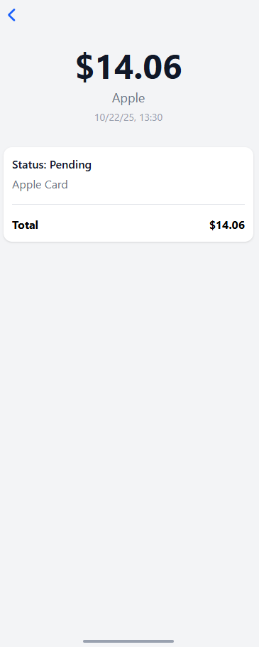

# 💳 Wallet App

A modern, mobile-first wallet application built with React and TypeScript that provides a clean and intuitive interface for managing your financial transactions and tracking daily rewards.

🔗 **[Live Demo](https://wallet-p20ei32vr-yonas-halefoms-projects.vercel.app/)**




## 📱 Screenshots

<div align="center">
  <table>
    <tr>
      <td align="center">
        <strong>Main Dashboard</strong><br/>
        
      </td>
      <td align="center">
        <strong>Transaction Details</strong><br/>
        
      </td>
    </tr>
  </table>
</div>

## 🌟 Features

### 📱 **Mobile-First Design**
- Optimized for mobile devices with responsive layout
- Clean, modern UI with smooth animations
- Touch-friendly interface with proper spacing

### 💰 **Financial Overview**
- **Card Balance**: Real-time display of current balance and available credit
- **Payment Status**: Clear indication of payment due status
- **Daily Points**: Dynamic calculation of daily reward points based on seasonal algorithms

### 📊 **Transaction Management**
- **Transaction History**: View your latest 10 transactions
- **Transaction Details**: Detailed view of individual transactions
- **Smart Categorization**: Automatic categorization with merchant icons
- **Status Tracking**: Real-time pending/approved status updates

### 🎯 **Smart Features**
- **Daily Points Algorithm**: Sophisticated points calculation based on seasonal patterns
- **Date Intelligence**: Smart date formatting (Yesterday, Tuesday, or specific dates)
- **Cashback Tracking**: Automatic cashback percentage display
- **Authorized User Support**: Track transactions made by family members

## 🚀 Quick Start

### Prerequisites
- Node.js (version 16 or higher)
- npm or yarn package manager

### Installation

1. **Clone the repository**
   ```bash
   git clone <repository-url>
   cd wallet-app
   ```

2. **Install dependencies**
   ```bash
   npm install
   ```

3. **Start the development server**
   ```bash
   npm run dev
   ```

4. **Open your browser**
   Navigate to `http://localhost:5173` to view the application

### Build for Production

```bash
npm run build
```

The built files will be in the `dist` directory, ready for deployment.

## 🏗️ Project Structure

```
src/
├── components/          # Reusable UI components
│   ├── IconBadge.tsx   # Company icon with colored background
│   └── TransactionCard.tsx # Individual transaction list item
├── data/               # Static data files
│   └── transactions.json # Sample transaction data
├── pages/              # Route-level page components
│   ├── TransactionsList.tsx    # Main dashboard view
│   └── TransactionDetail.tsx   # Individual transaction details
├── types/              # TypeScript type definitions
│   └── index.ts        # Application interfaces
├── utils/              # Helper functions
│   ├── calculateDailyPoints.ts # Points calculation algorithm
│   └── dateUtils.ts    # Date formatting utilities
└── App.tsx             # Main application component
```

## 🎨 Design System

### Color Palette
- **Primary**: Clean whites and light grays for cards
- **Background**: Light gray (#f3f4f6) for main background
- **Accent**: Blue (#3b82f6) for interactive elements
- **Text**: Dark gray (#111827) for primary text

### Typography
- **Font Family**: System UI fonts (San Francisco, Segoe UI, etc.)
- **Hierarchy**: Clear size differentiation for headings and body text
- **Weight**: Semibold for important information, regular for descriptions

### Components
- **Cards**: Rounded corners (12px) with subtle shadows
- **Icons**: FontAwesome icons with colored backgrounds
- **Buttons**: Touch-friendly with proper hover states
- **Lists**: Horizontal separators for clean organization

## 🔧 Technical Details

### Built With
- **React 19** - Modern React with latest features
- **TypeScript** - Full type safety throughout the application
- **Vite** - Fast build tool and development server
- **Tailwind CSS v4.1** - Utility-first CSS framework
- **React Router** - Client-side routing
- **FontAwesome** - Professional icon library
- **date-fns** - Modern date utility library

### Key Features
- **100% TypeScript** - Complete type safety
- **Mobile-First** - Responsive design starting from mobile
- **Component Architecture** - Reusable, maintainable components
- **Performance Optimized** - Fast loading and smooth interactions
- **Accessibility** - Proper ARIA labels and keyboard navigation

## 📱 How It Works

### Daily Points Calculation
The app features a sophisticated points system that calculates daily rewards based on seasonal patterns:

- **Seasonal Basis**: Points reset each season (Spring, Summer, Autumn, Winter)
- **Progressive Algorithm**: 
  - Day 1: 2 points
  - Day 2: 3 points
  - Day N: Previous day's points × 60% + Day before previous × 100%
- **Smart Formatting**: Large numbers displayed as "K" format (e.g., 28745 → "29K")

### Transaction Management
- **Real-time Updates**: Instant status changes from pending to approved
- **Smart Date Display**: Recent transactions show relative dates (Yesterday, Tuesday)
- **Merchant Recognition**: Automatic icon assignment based on transaction type
- **Family Support**: Track transactions made by authorized users

### Navigation Flow
1. **Dashboard View**: Overview of balance, points, and recent transactions
2. **Transaction Details**: Tap any transaction to view full details
3. **Seamless Navigation**: Smooth transitions between screens

## 🎯 Use Cases

### Personal Finance Management
- Track daily spending and income
- Monitor card balance and available credit
- Review transaction history for budgeting

### Family Account Management
- Monitor transactions made by family members
- Track shared expenses and payments
- Maintain financial transparency

### Rewards Optimization
- Understand daily points accumulation
- Plan spending around seasonal patterns
- Maximize reward benefits

## 🔮 Future Enhancements

- **Real-time Sync**: Connect to actual banking APIs
- **Budget Tracking**: Set and monitor spending limits
- **Analytics Dashboard**: Visual spending patterns and trends
- **Push Notifications**: Real-time transaction alerts
- **Multi-card Support**: Manage multiple cards in one app
- **Export Features**: Download transaction history

## 📄 License

This project is licensed under the MIT License - see the [LICENSE](LICENSE) file for details.

## 🤝 Contributing

Contributions are welcome! Please feel free to submit a Pull Request. For major changes, please open an issue first to discuss what you would like to change.

## 📞 Support

If you have any questions or need help with the application, please open an issue in the repository or contact the development team.

---

**Built with ❤️ using React, TypeScript, and modern web technologies**
